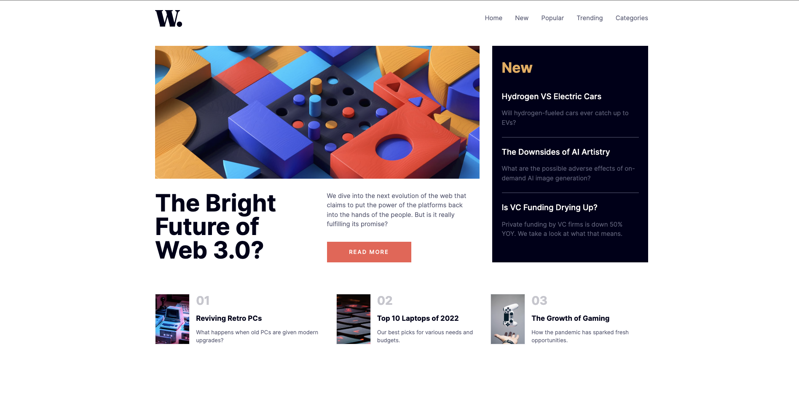

# Frontend Mentor - News homepage solution

This is a solution to the [News homepage challenge on Frontend Mentor](https://www.frontendmentor.io/challenges/news-homepage-H6SWTa1MFl). Frontend Mentor challenges help you improve your coding skills by building realistic projects.

## Table of contents

- [Overview](#overview)
  - [The challenge](#the-challenge)
  - [Screenshot](#screenshot)
  - [Links](#links)
- [My process](#my-process)
  - [Built with](#built-with)
  - [What I learned](#what-i-learned)
  - [Continued development](#continued-development)
  - [Useful resources](#useful-resources)
- [Author](#author)

## Overview

### The challenge

Users should be able to:

- View the optimal layout for the interface depending on their device's screen size
- See hover and focus states for all interactive elements on the page

### Screenshot



### Links

- Solution URL: [Github](https://github.com/victorbruce/news-homepage)
- Live Site URL: [Add live site URL here](https://your-live-site-url.com)

## My process

### Built with

- Semantic HTML5 markup
- CSS modules
- Flexbox
- CSS Grid
- [React](https://reactjs.org/) - JS library
- [TailwindCss](https://tailwindcss.com) - For styles
- Vitest and React Testing Library - For writing component tests
- Typescript - For type-checking

### What I learned

- I learned how to use variable fonts for the first time.

```css
@font-face {
  font-family: "Inter", sans-serif;
  src: url("/fonts/Inter-VariableFont_slnt,wght.woff2") format("woff2-variations");
  font-weight: 100 1000;
  font-style: normal;
}

html {
  font-family: "Inter";
  font-size: 15px;
}
```

- Also I revisited how to handle responsive images when given images of different resolution size for each screen device.

```jsx

```

- I also learned different ways of customizing tailwindcss to extend it's functionalities. For example, setting design system variables such as colors, text size, font-family etc.

```js
export deafult {
  theme: {
    extend: {
      colors: {
        softOrange: "var(--soft-orange)",
        softRed: "var(--soft-red)",
        offWhite: "var(--off-white)",
        grayishBlue: "var(--grayish-blue)",
        darkGrayishBlue: "var(--dark-grayish-blue)",
        veryDarkBlue: "var(--very-dark-blue)"
      },
      textColor: {
        softOrange: "var(--soft-orange)",
        softRed: "var(--soft-red)",
        offWhite: "var(--off-white)",
        grayishBlue: "var(--grayish-blue)",
        darkGrayishBlue: "var(--dark-grayish-blue)",
        veryDarkBlue: "var(--very-dark-blue)"
      },
    },
  },
}
```

- Setting up tests using Vitest and React Testing Library to test individual components whiles applying type saftey using Typescript.

### Continued development

In the future projects I will focus on applying motions and animations to components to improve the user experience.

### Useful resources

- [Responsive Images Done Right](https://www.smashingmagazine.com/2014/05/responsive-images-done-right-guide-picture-srcset/) - This resource helped me understand how to properly use `srcset` and `sizes` attribute to achieve image responsiveness.

- [CSS Variable Fonts](https://www.digitalocean.com/community/tutorials/css-variable-fonts) - This article helped me understand how to setup local variable fonts.

## Author

- Website - [victorbruce.vercel.app](https://victorbruce.vercel.app)
- Frontend Mentor - [@victorbruce](https://www.frontendmentor.io/profile/victorbruce)
